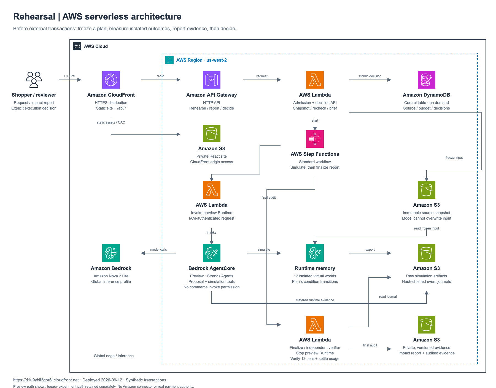

# Rehearsal

**See the impact. Then decide.**

Rehearsal tests an AI agent’s purchase plan in isolated virtual worlds before an external transaction can happen. Compare the cost, delivery and failure cases, then decide whether the plan is worth taking forward.

[Live demo](https://d1u9yhii3gor6j.cloudfront.net) · [Architecture](docs/ARCHITECTURE.md) · [Development](docs/DEVELOPMENT.md) · [Verification](docs/VERIFICATION.md)

## One request, twelve rehearsals

A family needs **one tent and two lanterns by Friday evening, for under $200 including shipping**. If the tent cannot arrive, do not buy the lanterns alone.

1. **Freeze** the request and catalog snapshot.
2. **Plan** with Amazon Nova 2 Lite and **Strands Agents SDK**.
3. **Rehearse** three supplier plans across four conditions: normal, A losing stock, A raising its price, and a missing payment reply.
4. **Compare** independently verified spending, delivery, reservations and duplicate payments.
5. **Decide** whether to decline or export a brief for execution review.

| Plan | Normal basket cost | Normal simulated arrival | Tested conditions met |
|---|---:|---|---:|
| A — Nova’s initial proposal | $149 | Thursday evening | 2/4 |
| B — report recommendation | $179 | Friday afternoon | 4/4 |
| C | $129 | Monday evening | 0/4 |

These are recorded simulation results. Stock and price shocks target A; the counts are not real-world success probabilities. The catalog is synthetic, with no Amazon/Rufus integration or real payments. Accepting a plan records an evidence brief, not an order.

## Built with

**Strands Agents SDK · Amazon Nova 2 Lite · Amazon Bedrock AgentCore**

React/TypeScript on CloudFront and S3; API Gateway, Lambda and Step Functions for orchestration; DynamoDB for admission, source revisions and decisions. Temporary simulation state is exported to S3 before the runtime stops.



The preview role has no commerce execution permission. A separate verifier produces the report. Acceptance checks the exact plan, source revision and fifteen-minute evidence validity. Compute runs on demand; storage and service requests remain metered.

## Run and test

Prerequisites: Python 3.12+, uv, Make and Git. Setup installs pinned runtimes and dependencies locally. Docker is only required for the optional Medusa backend.

```sh
make setup          # Install dependencies; no model calls
make check          # Offline Python, types, lint, docs and web build
make check-browser  # Local browser tests
make dev            # Local API and observer UI
```

Open `http://127.0.0.1:15173` for the local observer. The hosted preflight uses the AWS demo linked above; its setup is documented in the [deployment guide](infra/serverless/README.md). Starting a hosted rehearsal consumes a finite shared model allowance. Reading a saved report makes no new model calls.

## Repository

| Path | Contents |
|---|---|
| `src/rehearsal/preflight/` | Planning, isolated simulations, impact reports and decisions |
| `src/rehearsal/serverless/` | AWS runtime, transaction domain and independent verifier |
| `web/` | Hosted preflight and local observer UI |
| `infra/serverless/` | Deployment templates and instructions |
| `tests/`, `scenarios/` | Automated checks and reproducible scenarios |
| `services/medusa/` | Optional local commerce integration |
| `docs/` | Architecture, development and verification guides |

[MIT License](LICENSE) · [Third-party notices](THIRD_PARTY_NOTICES.md)
