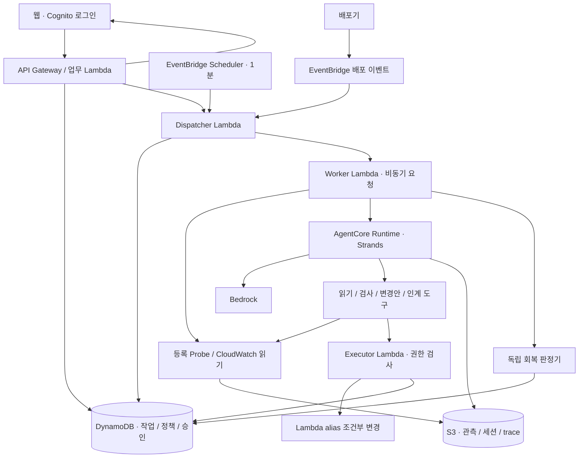
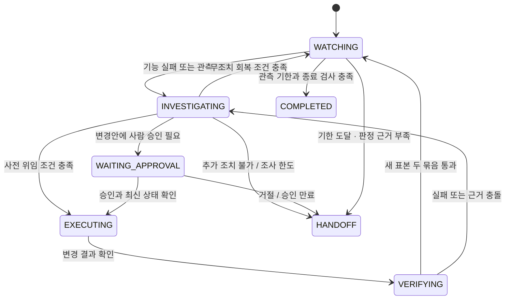

# Aftercare — 제품·시스템 설계 v1

작성: 2026-09-06 · 상태: 구현 전 설계 · 기준: [최신 제안서](../../agents-for-human-propsal.html)

이 문서는 구현자가 첫 서비스를 만들 수 있도록 제품 흐름과 책임 경계를 정한다. 데이터·API 세부 규칙은 [계약](CONTRACTS.md), 작업 순서와 완료 기준은 [구현 계획](../plans/2026-09-06-aftercare-implementation-plan.md)에 둔다. 아래 수치와 구조는 설계 결정이며 측정 결과가 아니다.

## 1. 만들 제품과 첫 성공 조건

**작은 웹 서비스팀이 배포 이후의 확인 업무를 맡기는 운영 동료.** 배포 이벤트를 받으면 실제 기능 결과를 확인하고, 이상 원인을 조사한 뒤 허용된 롤백 또는 근거 있는 인계를 수행한다.

첫 성공 조건은 배송비 API의 기능 오류를 실제 AWS에서 발견하고, Strands가 현재·이전 버전을 대조한 뒤 alias를 되돌리고, 새 요청 결과로 회복을 확인하는 것이다. 이 흐름이 완결되기 전에는 기능을 넓히지 않는다.

| 구분 | v1 결정 |
|---|---|
| 사용자 | 별도 SRE 없이 직접 배포하는 개발자; 첫 인터뷰로 빈도·부담 확인 |
| 범위 | 한 AWS 계정·리전, 배송비 견적 서비스 하나, 지정 alias 하나 |
| 입력 | 신뢰하는 배포기의 배포 완료 이벤트, 등록 검사, 승인·중단 |
| 출력 | 배포 카드, 근거가 연결된 결정, 회복 또는 인계 기록 |
| 자동 변경 | 미리 승인한 호환 가능한 이전 버전으로 alias rollback, 배포당 최대 1회 |
| 기본 모드 | 관측 30분, 1분 간격 목표; 자동 변경 기본값은 `approval_required` |
| 데모 모드 | 명시적으로 켠 `preauthorized` 정책, 재검사 묶음 간격 15초; 화면에 데모 모드 표시 |
| 제외 | 멀티클라우드·EKS·임의 명령 실행·자율 코드 변경·결제·실제 개인정보 |

`preauthorized`는 사람이 서비스·버전·유효기간·한도를 먼저 지정한 정책이다. LLM의 “승인됨” 설명은 권한이 아니다.

## 2. 사용 경험

### 한 번 연결하고 배포마다 맡긴다

1. **연결:** 등록된 서비스를 선택하고 검사 내용·이전 버전·관측 기간을 검토한다. v1은 임의 AWS 계정 연결 wizard 대신 운영자가 준비한 서비스만 지원한다.
2. **정책:** 승인 후 롤백 또는 사전 위임을 선택한다. 변경 대상과 종료 조건을 같은 화면에 표시한다.
3. **배포 카드:** 이벤트 수신 후 자동 생성된다. 현재 영향, 최신 관측 시각, 다음 행동을 먼저 보여준다.
4. **판단 요청:** “이 버전으로 되돌릴까요?”와 근거·영향 범위·승인 만료 시각을 표시한다.
5. **마무리:** 관측 기간을 마치거나 인계한다. 어떤 검사를 통과했는지, 아직 모르는 점이 무엇인지 남긴다.

브라우저를 닫아도 서버 작업은 진행한다. 화면은 3초 간격 polling을 기본으로 하고 비활성 탭은 15초로 낮춘다. 실시간 WebSocket과 대화형 채팅은 P0에 넣지 않는다.

### 배포 카드의 정보 순서

```text
Shipping Quote                  관측 중 · 18분 남음
현재 상황     새 버전에서 원격 지역 배송비가 예상과 다릅니다.
다음 행동     같은 요청을 이전 버전으로 확인합니다.
마지막 관측   14:03:12 · 기능 검사 5개 중 2개 실패

[자동 변경 중단]  [근거 펼치기]

판단이 필요한 경우
이전 버전 41로 되돌리기 · 지정 alias live만 변경
같은 검사에서 이전 버전은 통과했습니다. 승인 유효시간 02:00
[승인하고 계속] [거절하고 인계]
```

숫자와 문구는 화면 예시다. 본문에서 AWS ARN·토큰·stack trace를 먼저 노출하지 않는다. 영어 UI를 제출 기본으로 만들고 한국어 문구는 기획 참고로 사용한다. 주요 상태는 색과 함께 텍스트로 표시하고 키보드로 승인·거절·근거 열기가 가능해야 한다.

## 3. 구현 구조

Python 3.12 기반 domain/application/Strands adapter, React + TypeScript + Vite 웹, CDK TypeScript 인프라를 기본안으로 정한다. 패키지 버전은 P01/L01에서 설치 가능한 조합을 검증한 뒤 lock한다. AWS 리전과 Bedrock model ID는 L01의 실제 접근 확인 후 확정한다.



- **Dispatcher:** due 작업을 찾아 실행 요청을 전달한다. 원인을 판단하지 않는다.
- **Worker:** 작업의 현재 version·lease·기한을 검사한다. 정상 tick은 probe와 판정만 실행하고, 새로운 이상 또는 승인 재개에서 Strands를 호출한다.
- **Strands:** 도구 결과에서 조사할 근거를 선택하고 가설을 바꾼다. 권한과 최종 health 판정을 직접 작성하지 않는다.
- **Executor:** 저장된 변경안 ID만 받으며 허용 대상과 최신 상태를 재검사한다. AgentCore 역할에는 `UpdateAlias`를 부여하지 않는다.
- **회복 판정기:** 순수 함수로 표본·시각·버전·검사 계약을 평가한다. 코드에서 만든 verdict를 UI가 사용한다.
- **API:** 사용자 소유권과 요청 version을 검사하고 작업·승인 명령을 저장한다. 장시간 실행 결과를 HTTP 요청 안에서 기다리지 않는다.

AgentCore를 연결하기 전에는 Worker 안의 Strands adapter로 동일한 application 인터페이스를 사용한다. AgentCore 연결이 지연되면 Lambda 경로를 유지하되 실제 배포 경로를 제출 자료에 명시한다.

### 비동기 실행과 복원

DynamoDB의 작업이 실행 여부의 기준이다. 상태 저장 후 실행 요청 전 프로세스가 죽어도 `next_due_at`을 유지해 다음 tick이 다시 전달한다. Worker가 조건부로 `lease_token`을 얻고, 모든 결과 저장은 해당 token·`state_version`에 묶는다. GSI 조회는 후보 탐색이며 쓰기 전 원본 항목을 다시 확인한다.

Lambda 비동기 전달에는 재시도·중복이 있을 수 있다. 메시지가 한 번만 도착한다고 가정하지 않는다. on-failure destination은 운영 확인용 SQS 하나로 두고, 기한이 지난 요청은 Worker에서 폐기한다. [Lambda 비동기 오류 처리](https://docs.aws.amazon.com/lambda/latest/dg/invocation-async-error-handling.html)

초기 상한은 Worker 180초, 업무 lease 240초, Strands 한 조사 90초, Executor 30초다. 호출 timeout을 안쪽부터 짧게 설정한다. 만료 lease를 인계받은 Worker는 먼저 진행 중 변경을 조회하며, 이전 실행이 끝났다는 근거가 없으면 새 변경을 시작하지 않는다. 이 수치는 L02 부하·실패 실증에서 조정한다.

Scheduler는 60초 정밀도이므로 tick 지연을 측정한다. 데모의 15초 재검사는 제한된 probe worker 한 번 안에서 두 묶음을 실행하며 15초 스케줄을 만들지 않는다. [Scheduler 주기](https://docs.aws.amazon.com/scheduler/latest/UserGuide/schedule-types.html)

## 4. 작업 상태와 건강 판정을 분리한다

`phase`는 지금 수행하는 일, `health`는 최신 기능 관측, `outcome`은 종료 이유다. “인계 완료”와 “회복 확인”은 다른 결과다.



모든 비종료 단계에서 중단 요청은 `STOPPING`을 거쳐 `STOPPED`, 외부의 새 배포 감지는 `SUPERSEDED`로 간다. 이미 실행 중인 변경은 결과 조회까지 마무리한 뒤 닫으며, 추가 쓰기는 하지 않는다. 종료 단계에서는 일반 tick·오래된 승인으로 다시 열지 않는다. 이후 배포는 새 job이다.

| 값 | 의미 |
|---|---|
| health `UNKNOWN` | 아직 유효 표본 없음 또는 수집 실패 |
| health `PASS` | 가장 최근의 완전한 검사 묶음 통과 |
| health `FAIL` | 등록 검사에서 실제 기능 실패 관측 |
| health `STALE` | 마지막 표본이 허용 최신성 범위를 벗어남 |
| outcome `NO_ISSUE` / `RECOVERED` | 관측 종료 조건 충족; 후자는 이상과 회복 기록이 존재 |
| outcome `UNRESOLVED` / `UNVERIFIED` | 해결되지 않은 영향 또는 충분한 관측 없음 |
| outcome `CANCELLED` / `SUPERSEDED` | 사용자 중단 또는 더 최신 배포로 작업 교체 |

`WATCHING + PASS`는 장기 정상 보장이 아니다. 회복 후 재실패가 보이면 `incident_epoch`를 올리고 이전 표본을 버린다. 자동 롤백 한도는 epoch와 무관하게 배포 전체에 1회다.

## 5. 등록 검사와 회복 계약

5개 배송비 입력을 하나의 검사 묶음으로 실행한다. 기대값은 서비스 구현과 독립된 버전 관리 계약이며 LLM과 서비스 응답에서 새로 생성하지 않는다. 자세한 입력은 [계약 2절](CONTRACTS.md#2-배송비-검사)을 따른다.

- 정상 서비스 경로는 API Gateway를 통한다. 각 응답에 실행 버전·함수 요청 ID·Gateway 요청 ID를 연결한다.
- 현재·이전 버전 대조는 동일한 등록 요청을 명시적 Lambda version으로 호출한다. 이것은 조사 근거이며 실제 alias 경로의 회복 검사를 대체하지 않는다.
- `Invoke`의 전송 성공과 함수 실행 성공은 구분한다. `FunctionError`, 응답 body의 기능 결과와 `ExecutedVersion`을 각각 검사한다. [Lambda Invoke](https://docs.aws.amazon.com/lambda/latest/api/API_Invoke.html)
- 회복에는 변경 확인 뒤 시작한 서로 다른 두 묶음, 각 5개 고유 검사 ID, 기대 버전, 계약 버전, 동일 incident epoch가 필요하다. 변경 없이 회복한 경우는 최신 실패 관측 이후의 두 묶음을 사용하고 `recovery_kind: observed_without_action`으로 구분한다.
- 두 번째 묶음 시작은 첫 번째 종료 후 기본 60초 이상, 데모 15초 이상이다. 기본 모드는 다음 실행 가능한 tick에서 수집하므로 정확히 60초라고 주장하지 않는다.
- 최신성 기본 허용치는 180초, 데모는 90초로 제안한다. 요청 하나라도 실패·누락·시간초과면 해당 묶음은 통과가 아니다.
- 최신 alias를 재조회해 revision·version이 바뀌지 않았는지 확인한다. weighted alias는 v1에서 지원하지 않고 연결 시 거부한다.

관측 종료에는 기한 도달, unresolved incident 없음, 최근 유효 묶음 두 개, 최대 관측 공백이 허용 최신성 이내라는 조건이 필요하다. 공백이 크면 최종 표본이 통과해도 `UNVERIFIED` 인계한다. 근거 파일 저장 실패 시에는 “회복 확인”을 확정하지 않는다.

## 6. 조사와 승인

도구는 `inspect_release`, `read_evidence`, `run_registered_probe`, `prepare_action`, `execute_approved_action`, `request_handoff` 여섯 개다. 모델이 넘긴 ARN·URL·사용자 ID를 그대로 실행하지 않고 서버의 서비스 등록 정보로 해석한다.

조사에는 사건 요약, 비식별 배포 설명, 등록된 검사 계약과 evidence ID만 전달한다. 로그와 응답은 신뢰하지 않는 데이터다. 도구 결과의 출처 ID가 없는 주장으로 변경안을 승인하지 않는다. 초기 조사 한도는 model turn 8회·tool call 12회·전체 90초 중 먼저 도달하는 것으로 제안한다. 숫자와 소진 이유를 실행 기록에 남긴다.

Strands interrupt/resume를 승인 도구 앞에 둔다. 세션 저장소에서 interruption·메시지를 복원하고 새 Agent 인스턴스에 응답을 전달한다. 도구 재실행이 가능하므로 interrupt 이전에는 변경 부작용을 수행하지 않는다. 승인 응답은 서버의 승인 항목과 함께 검증한다. [Strands interrupts](https://strandsagents.com/docs/user-guide/concepts/interrupts/)

AgentCore 메모리를 작업 장부로 사용하지 않는다. Runtime 세션은 중지·재생성될 수 있으므로 DynamoDB와 S3 session checkpoint로 새 프로세스에서 이어갈 수 있어야 한다. checkpoint 손상 시 새 조사 또는 인계로 전환하며 승인을 추측해 복원하지 않는다. [Runtime 세션](https://docs.aws.amazon.com/bedrock-agentcore/latest/devguide/runtime-sessions.html)

## 7. 실제 변경의 경계

변경안은 서비스·job·epoch·정책 revision·목표 버전·관측 근거·예상 alias revision·기한의 조합으로 고정한다. 승인 시점뿐 아니라 실행 직전에도 검증한다. 이전 버전의 데이터 호환성은 서비스 등록 시 소유자가 확인하며 에이전트가 추론해 승인하지 않는다.

1. DynamoDB transaction으로 job version, 승인, 변경 한도, 취소 여부를 검사하고 action을 `EXECUTING`으로 예약한다.
2. Executor가 `GetAlias` 결과와 계획을 대조한다. 불일치하면 action을 폐기하고 새로운 배포 상태를 반영한다.
3. 동일 `RevisionId`를 사용해 `UpdateAlias`를 한 번 전송한다. 변경 호출의 SDK 자동 재시도는 끄고 실패 유형을 application이 처리한다.
4. 응답 유무와 관계없이 `GetAlias`를 다시 읽고 목표 버전·새 revision을 기록한다. 애매하면 `UNKNOWN` 실행 결과로 두고 조회만 재시도한다.
5. 기록 저장과 독립 재검사가 끝나기 전에는 복구 완료를 표시하지 않는다.

`RevisionId`는 읽은 이후 alias가 바뀌는 충돌을 감지하는 AWS 조건이다. [UpdateAlias](https://docs.aws.amazon.com/lambda/latest/api/API_UpdateAlias.html) DynamoDB transaction은 내부 상태의 원자성을 제공하지만 Lambda 변경까지 하나의 transaction으로 묶지는 못한다. 따라서 v1은 “정확히 한 번 실행”을 보장한다고 주장하지 않고, 단일 변경 예약·재조회·실제 변경 횟수 검증으로 중복 위험을 다룬다. [DynamoDB transactions](https://docs.aws.amazon.com/amazondynamodb/latest/developerguide/transaction-apis.html)

중단과 실행 예약의 경합에서는 먼저 성공한 상태 변경을 기준으로 한다. 중단이 먼저면 쓰기 0회, 실행 예약이 먼저면 UI는 `STOPPING`과 “진행 중 조치 결과 확인 중”을 보여준다. 이미 시작한 AWS 호출을 취소했다고 표시하지 않는다.

## 8. 데모 접근과 격리

v1 심사 환경은 **공유 서비스 한 개, 동시 실행 한 개**다. 로그인한 사용자가 `demo_run`을 만들면 서버가 소유자를 저장한다. 다른 사용자는 해당 job을 읽거나 승인·중단할 수 없다. 서비스가 사용 중이면 `409 DEMO_BUSY`와 다시 시도 안내를 준다. 대기열과 다중 tenant provisioning은 만들지 않는다.

시나리오 주입·초기화는 전용 Demo Controller 역할만 수행한다. AgentCore·Executor 역할에는 주입 권한이 없다. 주입기의 case ID와 정답은 actor context에서 제거한다. 새 run은 이전 worker·변경의 종료를 확인하고 의존성·alias를 원복한 뒤에만 시작한다. 무응답 작업의 lease가 만료됐다는 이유만으로 서비스 잠금을 해제하지 않는다.

첫 실증은 개발자 로그인으로 수행하고 공개 데모의 계정 발급·심사 접근 방법은 L04에서 검증한다. 사용자별 하루 3회, 전역 동시 1회, 실행당 모델·probe 상한은 초기 제안값이며 실제 비용을 확인해 조정한다. quota 확인과 예약은 원자적으로 처리한다. AWS 자격증명은 브라우저에 전달하지 않는다.

## 9. 파일 구조와 테스트 경계

```text
src/aftercare/
  domain/             # 타입·상태 전이·권한·회복 판정, SDK import 없음
  application/        # 이벤트 처리·조사·실행·인계 use case
  ports.py            # Clock, Repository, Probe, Release, Agent, EvidenceStore
  adapters/aws/       # DynamoDB, Lambda, CloudWatch, S3
  adapters/strands/   # 도구·hook·session 복원
  entrypoints/        # API, dispatcher, worker, AgentCore handler, executor
web/                  # React/TypeScript 화면과 API client
infra/                # CDK TypeScript; Core / Agent / Web / Demo stack
examples/shipping/    # 정상·기능 오류 버전과 합성 의존성
contracts/            # JSON schema와 검사 계약; 생성물은 버전 관리
tests/                # 아래 층별 테스트
  unit/ integration/ contracts/ live/
evaluation/           # 개발 사례·baseline·측정 도구; actor가 정답에 접근하지 않음
```

오프라인 테스트는 fake Clock·in-memory repository·stub AWS 응답을 주입한다. 실제 모델 품질과 IAM·alias 동작은 별도 live 검증 대상이다. `make check`에는 단위·계약·AWS adapter stub·frontend 테스트·CDK synth assertion을 준비되는 순서대로 추가하며, 의존성 부재를 통과 처리하지 않는다. 도구 설치와 네트워크 다운로드는 gate 밖에서 수행한다.

## 10. 첫 실증에서 확정할 항목

| 항목 | 기본안 | 확정 시점 |
|---|---|---|
| 리전·Bedrock 모델·SDK lock | 실제 사용 계정에서 접근 가능한 조합 | L01, 첫날 |
| AgentCore session adapter | S3 기반 checkpoint, application 상태는 DynamoDB | P07/L03 |
| 조사 시간·호출·probe 한도 | 위 설계값 | L02의 사례 A 실측 |
| 30분 관측·최신성 범위 | 1분 목표 주기, 최대 공백 180초 | L03 30분 실행 |
| 심사 계정·상시 접근·일일 quota | 공유 서비스·동시 1회 | L04 |

위 항목은 이번 설계 작성을 막는 질문이 아니다. 계획에 명시된 실증 단계에서 근거를 남기고 결정 기록을 갱신한다.
