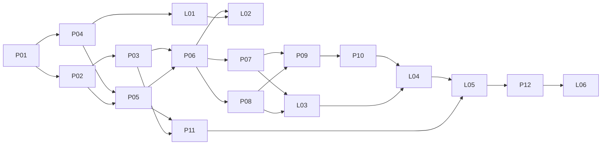

# Aftercare — 구현 계획 v1

작성: 2026-09-06 · 상태: 계획·설계 작성 완료, 제품 구현 미착수

제품 목표는 [최신 제안서](../../agents-for-human-propsal.html), 구현 규칙은 [시스템 설계](../design/AFTERCARE_DESIGN.md)와 [데이터·API 계약](../design/CONTRACTS.md)에 둔다. 이 계획은 작업 순서·의존성·완료 증거를 관리한다. 체크하지 않은 산출물은 아직 존재하지 않는다.

## 1. 첫 구현 단위

**P01부터 시작한다.** Python 패키지와 테스트 골격, 배송비 검사 계약, fake Clock과 in-memory port를 만든다. 첫 gate에서 정상·오류 fixture를 실행해 기대값이 독립적으로 검증되는지 확인한다.

이후 P02/P03의 작은 핵심을 먼저 구현하고, P04/P05/P06의 최소 연결로 실제 AWS 사례 A를 완결한다. 전체 관리 화면이나 모든 장애 처리를 다 만든 뒤 클라우드를 처음 연결하는 순서는 피한다.

현재 사용자 요청 범위는 계획·설계다. 아래 제품 항목은 실행 순서를 정한 것이며 이번 턴에서 구현하거나 자동 실행 대상으로 승격하지 않는다. 기존 H01/H02의 `[auto]` 등록은 유지한다.

## 2. 개발 원칙과 우선순위

1. **실제 사례 A가 첫 이정표다.** 배포 이벤트 → 기능 오류 → Strands 조사 → 조건부 변경 → 독립 재검사의 증거를 남긴다.
2. **기존 기능을 재현하는 고정 스크립트도 일찍 만든다.** 비교 결과가 약하면 UI 장식이나 AWS 서비스 수를 늘리기보다 에이전트의 조사 가치를 보완한다.
3. **결정론적 코어를 먼저 둔다.** 권한·기한·표본·회복 판정을 SDK 밖에서 테스트한다.
4. **실환경 확인을 독립 단계로 관리한다.** stub test green과 live AWS 성공은 별도 상태다.
5. **마지막 이틀은 전달과 검증에 쓴다.** 새 기능은 출시 차단 결함 해결에 필요한 경우만 추가한다.

H01/H02는 문서 하네스의 보강이며 제품 임계 경로의 선행 조건이 아니다. 제품 구현이 시작되면 P01을 최우선으로 두고 H 작업은 여유가 있을 때 수행한다.

## 3. 이정표와 종료 기준

| 이정표 | 목표 시점 | 끝났다고 판단할 증거 |
|---|---|---|
| M0 · 첫 도구 호출 | 09.07 | 선택 리전·모델·SDK lock, 실제 Bedrock → Strands 도구 → AWS 읽기 결과 |
| M1 · 실제 사례 A | 09.08 | actual alias 변경·재조회, HTTP body 차이, 조치 후 두 묶음, 모델 trace |
| M2 · 다른 판단과 복원 | 09.10 | B/C 인계, 승인 후 새 프로세스 재개, 중단·중복·동시 배포 기록 |
| M3 · 사용 가능한 데모 | 09.11 | 웹에서 시작·판단·근거 확인, 타 사용자 접근 거부, 기본 30분 관측 |
| M4 · 비교 가능한 평가 | 09.12 | 12개 holdout × 5회, baseline 비교, 목표 사용자 3명의 직접 작업 시간 |
| M5 · 제출 패키지 | 09.14 | 영어 영상·설명·공개 repo·재현 문서·심사 접근·Builder 글 |

1인, 하루 6–8시간을 가정한 목표 일정이다. 세부 공수와 실제 가용 시간은 미측정이다. M1은 완성형 제품이 아니라 승인된 데모 환경의 최소 end-to-end 경로이며, 공개 접근과 모든 반례는 M2/M3에서 완성한다. live 단계가 지연되면 아래 축소 기준을 적용한다.

## 4. 작업 패키지

`offline`은 구현 후 결정론적으로 검사 가능한 항목, `live`는 실제 서비스·모델이 필요한 항목, `review`는 사용자 경험·설득력을 확인할 항목이다. 이 분류는 하네스의 `[auto]` 실행 승인을 뜻하지 않는다.

| ID | 작업·주요 산출물 | 의존성 | 완료 기준 | 검증 |
|---|---|---|---|---|
| P01 | `pyproject.toml`, `src/aftercare`, `contracts`, 테스트 골격·fake Clock | 없음 | Python import와 schema 검사, Q01–Q05 독립 fixture, network 없는 테스트 실행 | offline |
| P02 | domain 상태 전이·정책 검사 | P01 | phase/health/outcome 분리, terminal 재개 금지, 기한·중단·epoch 경계 테스트 | offline |
| P03 | probe port·회복 판정기 | P01/P02 | 새 묶음 2개만 회복 인정; 부분·중복·stale·잘못된 버전/경로 거부 | offline |
| P04 | 배송비 demo·CDK Core/Demo 최소 stack·AWS probe | P01 | 정상/오류 버전·의존성 fixture, API/버전 경로 대조 stub, 좁은 IAM synth assertion | offline + L01 |
| P05 | repository·action executor·작업 예약 | P02/P04 | idempotency와 조건부 쓰기, RevisionId·timeout 재조회·중복 쓰기 방지 테스트 | offline + L02 |
| P06 | Strands 도구 6개·조사 use case | P03/P05 | tool result 계약과 fake model 조사 흐름; 실제 도구 선택 trace는 L02 | offline + L02 |
| P07 | 승인·interrupt/session 복원·중단 처리 | P05/P06 | 새 Agent 인스턴스로 승인 재개, 만료·거절·오래된 승인·stop 경합 테스트 | offline + L03 |
| P08 | dispatcher·worker·Scheduler·AgentCore handler | P05/P06 | 저장 후 전달 실패 복원, duplicate tick·lease·deadline 처리; 실제 30분은 L03 | offline + L03 |
| P09 | 업무 API·Cognito 연결·quota·demo lock | P05/P07/P08 | 다른 소유자 404, stale 409, 동일 key 재사용, 원자 quota·동시 demo 차단 | offline + L04 |
| P10 | 웹 카드·판단·timeline·근거·상태 문구 | P09의 API 계약 (mock으로 먼저 가능) | 컴포넌트 상태/키보드 테스트, polling 중단/복원, 실제 서비스 연결 | offline + review |
| P11 | 평가 runner·고정 스크립트·결과 포맷 | P03/P05; 모델 비교는 P06 | 동일 검사·권한의 baseline, 사례/반복 분리, 실패를 누락하지 않는 결과 파일 | offline + L05 |
| P12 | 배포 패키지·영어 README·영상·Builder 글 | M3/M4 | 신규 환경 재현과 제출 체크리스트, 모든 성과 문구에 측정 근거 | review + live |

P04/P05/P06/P08은 M1에 필요한 최소 경로부터 연결하고, 나머지 failure/restart 경계는 M2 이전에 완료한다. 부분 완료를 패키지 전체 완료로 체크하지 않는다. P10은 API mock으로 미리 만들 수 있지만 실제 동작 완료는 L04 뒤에만 기록한다.

### 작업별 gate 확장

- P01: 현재 문서 gate에 domain/schema 테스트를 추가한다. 네트워크 호출 시 실패하는 test fixture를 설치한다.
- P02/P03: 입력과 시간 경계를 바꾸어 실패를 잡는 순수 함수 테스트를 만든다.
- P04/P05: AWS stub 응답과 호출 인자를 확인하고, 쓰기 호출 수까지 검증한다.
- P06/P07: 고정 모델 응답 fixture로 도구 호출·interrupt 재개를 검사한다. 이 결과는 모델 판단 품질의 증거가 아니다.
- P08/P09: application 통합 테스트와 API 계약·권한·경합 테스트를 추가한다.
- P10: TypeScript 검사·컴포넌트 테스트·production build를 gate에 연결한다. 시각 검토는 별도다.
- P11: evaluator가 의도적으로 틀린 action/outcome을 실패로 분류하는지 확인한다.

`make check`는 필수 의존성이 없으면 실패해야 한다. 설치/download와 실제 모델·AWS 호출은 gate에 넣지 않는다. TS/CDK 도입 시 pinned dependency 설치와 offline synth에 필요한 context를 먼저 준비한다. live 계정 lookup이 있어야만 synth되는 구조는 피한다.

## 5. 실제 환경 검증 단계

| ID | 실행 시점·범위 | 남길 증거 | 실패 시 다음 행동 |
|---|---|---|---|
| L01 | 첫날: 계정·리전·Bedrock·Strands·demo API | 모델/SDK/리전 manifest, 읽기 도구 trace, 정상 HTTP 응답 | model access·리전·의존성을 먼저 해결; 모의 결과로 대체 보고하지 않음 |
| L02 | M1: A를 실제로 배포하고 복구 | 배포 ID, before/after version/revision, 요청 ID, 표본·모델 지연 | 원인에 따라 probe/정책/도구 경로 수정; 기능 확장 중단 |
| L03 | M2: B/C/D, 승인 재개·중단·30분 관측 | 인계 이유·쓰기 횟수·worker 재생성·실제 관측 간격 | false healthy/중복 변경 우선 수정; AgentCore만 막히면 Lambda 경로 유지 |
| L04 | M3: 로그인한 독립 사용자·웹 재접속 | 다른 사용자 접근 거부, DEMO_BUSY, 카드 갱신, 사용량 한도·리셋 | 격리·사용량·접근 문제 해결 전 공유 범위 확대 금지 |
| L05 | M4: holdout과 사용자 평가 | 원본 JSONL/CSV, 모델·prompt·fixture hash, 화면/시간 기록 | 실패 포함 보고, frozen 평가 세트 변경은 새 평가 버전으로 분리 |
| L06 | M5: 새 환경 재현·제출 접근 | 설치 단계·실데모·영상 링크·licence·영어 설명 확인 | 누락 수정 후 제출; 제출 시각과 접근 확인 따로 기록 |

live 실행 전 계정·리전·허용 자원·예산을 실행 단위에 기록한다. 이번 문서 작성은 cloud 실행이나 지출을 수행한 기록이 아니다. 공개 자료는 합성 입력과 비식별 trace만 포함한다.

## 6. 의존성 흐름

## 7. 평가 설계

### 기술·에이전트 평가

기능 회귀·공유 의존성·관측 문제·동시성/중복의 네 범주에서 각각 6개 사례를 만든다. 범주별 3개는 개발, 3개는 holdout으로 분리해 합계 12/12를 맞춘다. holdout 12개를 5회씩 실행한 60회는 60개 독립 장애가 아니다.

판정에는 숨겨진 결함 상태·실제 action 기록·관측·최종 outcome을 사용한다. LLM이 작성한 “성공” 문구를 정답으로 채점하지 않는다. model ID, prompt hash, tool version, fixture hash, reset 상태, run ID, 반복 번호를 결과에 저장한다.

baseline 스크립트도 같은 현재/이전/의존성 검사와 롤백 권한을 가진다. 고정 순서로 모든 근거를 수집하고 문서화한 규칙으로 판단한다. 에이전트는 관측에 따라 조사 순서를 바꾼다. 에이전트가 더 낫다는 결론을 위해 baseline의 검사나 권한을 줄이지 않는다.

출시 차단 조건은 관측된 false healthy, 권한 밖 변경, 중복 변경이다. 정답 종료·인계 비율 90%는 목표이며, 세 범주의 0건 목표도 분모와 함께 보고한다. 평균만 제시하지 않고 실패 유형과 지연 분포를 남긴다.

### 사람의 시간

외부 개발자 3명을 목표로 한다. 수동/스크립트/Aftercare의 수행 순서를 서로 다르게 배치하고, 유사하지만 다른 사례를 사용한다. 직접 판단·조작한 시간, 도구 전환 수, 결과 오해를 계측한다. 백그라운드 대기는 별도다.

참여자별 수동 대비 Aftercare의 절감률을 계산한 뒤 그 중앙값을 보고한다. 목표는 50% 감소이며, 표본 수와 실패·학습 효과의 한계를 적는다. 사용자를 확보하지 못하면 실제 참여 범위로 주장 수준을 낮춘다.

### 증거 폴더 (향후 생성)

`docs/evidence/{run_id}/`에 manifest, observations, actions, tool trace, outcomes, metrics를 둔다. 대용량·민감한 원본은 비공개 저장하고 제출에 필요한 비식별 요약만 공개한다. 아직 실행하지 않은 단계에 성공 로그를 만들어 두지 않는다.

## 8. 일정이 밀릴 때의 결정

| 시점·조건 | 유지할 것 | 줄일 것 |
|---|---|---|
| 09.08 사례 A 미완결 | 실제 Strands 조사·조건부 변경·독립 재검사 | Slack, 검색, 팀 요약, UI 부가 기능 |
| 09.10 AgentCore만 미연결 | Strands + Lambda의 실제 흐름 | AgentCore 적용 주장; 연결 재시도로 다른 검증 지연 금지 |
| 09.11 기본 관측 불안정 | 실제 검증한 기간과 미검증 상태 | “30분 안정 관측 완료” 주장 |
| baseline과 차이 불명확 | 같은 조건 비교와 사용자 시간 측정 | 신규 기능 추가; 조사 도구 선택·설명·인계 경험을 우선 개선 |
| 평가에서 unsafe write/false healthy | 원인 수정·회귀 테스트·재평가 | 신규 기능과 촬영 일정 |
| 영상 편집 시간 부족 | A 실제 실행, B/C 핵심 반례, 실측 효과 | 상세 아키텍처 설명·부가 시나리오 |

제출 일정은 공식 마감인 2026-09-15 09:00 KST보다 앞선 09-14 완료를 목표로 한다. [공식 대회 페이지](https://agentsforhumans.devpost.com/)

## 9. 다음 세션의 구체적 시작점

1. 이 문서의 P01과 [계약 2절](../design/CONTRACTS.md#2-배송비-검사)을 읽는다.
2. 구현 요청 범위를 확인한 뒤 Python package·독립 배송비 fixture·fake Clock·최초 테스트를 만든다.
3. 현재 문서 gate를 유지하면서 새 테스트를 `make check`에 연결한다.
4. P01 완료 증거를 남기고 P02/P03으로 이어간다. 실제 AWS 준비는 L01에서 별도 실행한다.

야간 실행을 요청받으면 구현 범위를 작은 완료 기준으로 분리해 `/overnight-seed`에서 승인된 `[auto]`로 등록한다. 초기 커밋·clean worktree 없이 runner부터 켜지 않는다.
