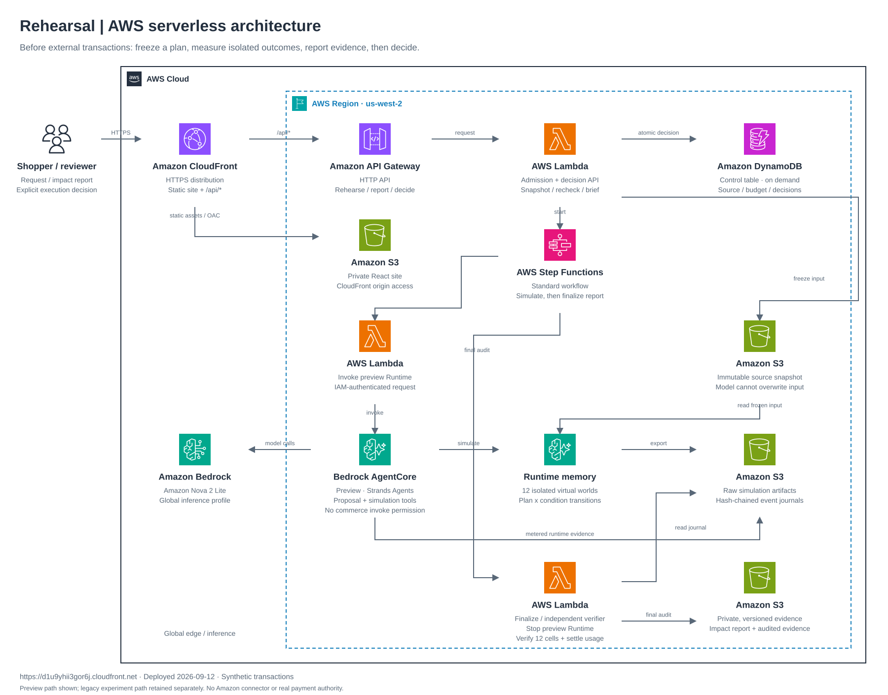
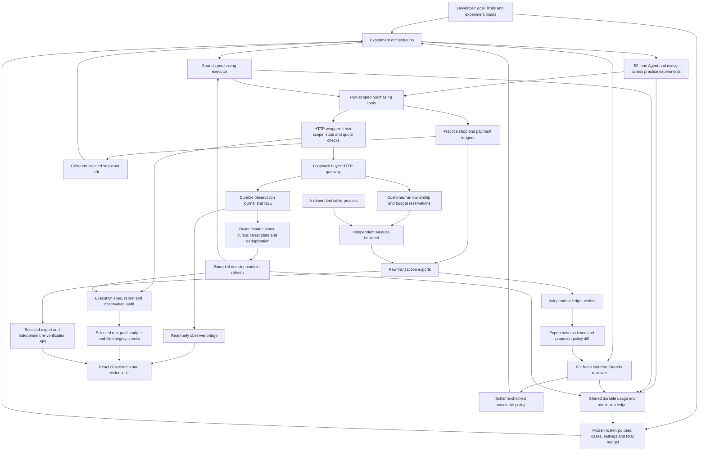

# Rehearsal — deployed AWS preflight architecture

The [hosted demo](https://d1u9yhii3gor6j.cloudfront.net) measures a plan before external execution. [AWS preview audit](../test/preflight-impact.md) · [Deployment guide](../../infra/serverless/README.md).

[Editable draw.io — two pages](../../submissions/architecture/rehearsal-serverless.drawio) · [PNG](../../submissions/architecture/rehearsal-serverless.png)

The first page shows the preview path with official AWS icons; the second details authority and costs. Both were opened in diagrams.net. The legacy transaction experiment infrastructure remains separately deployed for historical regression and is not the preview path shown here.

The API freezes an operator-owned synthetic catalog in an immutable S3 input. The separate preview AgentCore role reads it, calls Nova and writes raw evidence. It cannot invoke commerce or seller Lambdas, mutate commerce data, overwrite the input or publish the final report. Simulation state is temporary memory inside that runtime, not a database created for every experiment.

A separate Lambda stops the runtime, independently replays all twelve journals and publishes audited reports to S3. The model cannot declare a successful result through prose. Missing or invalid cells block execution handoff. Shared provider-usage accounting reserves before paid calls and retains unresolved amounts.

An explicit decision request binds the final report and selected plan hashes. The server checks source identity and expiry; a DynamoDB transaction checks the source revision while recording one final decision. The brief is evidence for execution review, not permission to charge a card. Replaying a decision returns its original timestamps and never extends validity.

# Historical local architecture

Implemented local paths, refreshed on 2026-09-12. Actual Amazon Nova 2 Lite runs now use the Strands loops and Medusa/browser integration; deterministic provider fixtures remain separate regression evidence. Arrows represent data or calls, not measured model effectiveness.

B2 uses one Agent and conversation for its own experiments and self-reflection. B3 uses a separate reviewer. Both have actual Nova and SDK fixture evidence. Frozen-policy evaluation uses a fresh Agent/world with shared accounting. Two actual five-condition pilots retain every failure and do not establish a Peer Review advantage.

The external roster freezes each cell before learning. It retains B0/B1/B2/B3, missing/failed cells and a total reservation ledger. B2/B3 external execution continues the original learning usage ledger. Reaction settings are disabled for B0 and identical across the model arms. Transaction success, configured-condition fidelity, reaction-record integrity and usage accounting are checked separately; no one flag replaces all four.

The reviewer cannot buy, mutate the world or declare success. Candidate policies are data, never executable code. Reexperiments start from an isolated fork; a candidate does not overwrite the initial policy automatically.

The purchasing adapter exposes only its bound run and server-controlled amounts. Medusa's Store order endpoint alone does not enforce the ownership boundary this application requires; the gateway checks it. UNKNOWN checkout outcomes retain reservations because an HTTP failure does not establish external rollback.

The buyer has its own read-only journal consumer, separate from browser consumers. It retains the latest semantic change while a model call is pending, refreshes the decision context and rechecks state before orders/payments. A changed condition blocks the stale action; the model must choose any replacement through its tools. Additional calls use the existing common limits. Clock changes alone do not trigger new decisions after an agent turn ends.

The observer bridge reads SSE and snapshots. It does not submit purchasing or administrator actions. Snapshot recovery restores the latest retained state rather than pretending to replay a missing history. Browser and buyer cursors may differ because they poll independently. The [actual Nova integration](../test/nova-reactive-video.md) checked the browser, execution records and independent exports; the earlier SDK integration remains separate evidence.

An operator selects execution input bytes and the expected run/goal/budget. The execution API replays the observation audit and checks terminal hashes; without a terminal manifest it returns only provisional records, never process-liveness assurance. The independent evidence API separately recomputes a transaction verdict from a selected raw export. Paths, credentials, model output and supplier prose are not forwarded by the execution-summary API. Neither UI animation, an agent response nor a file-integrity result is a transaction completion authority.

[Standalone diagram](architecture.svg) · [English testing](TESTING.md)
