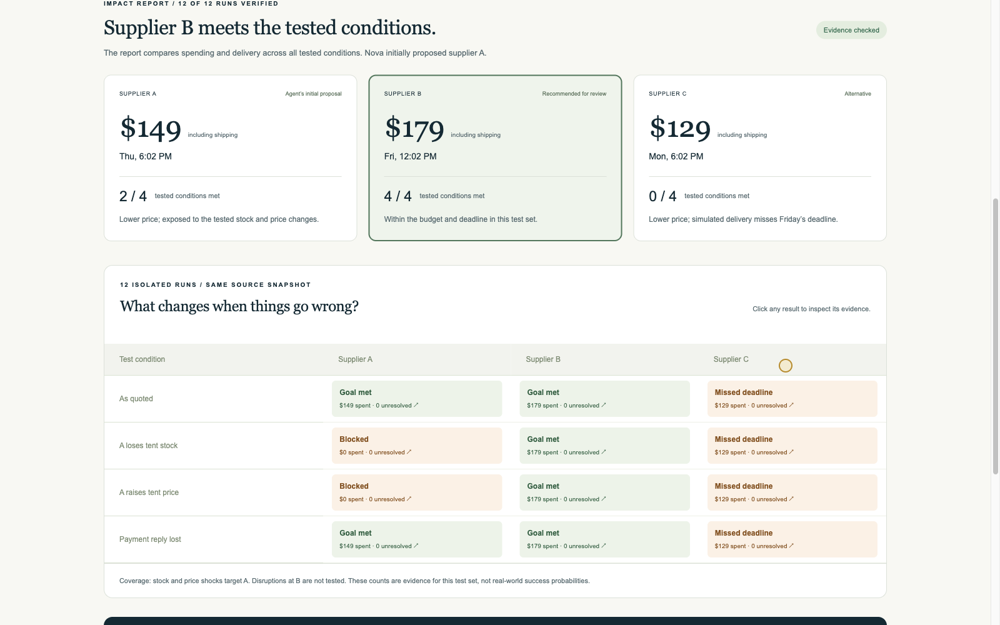
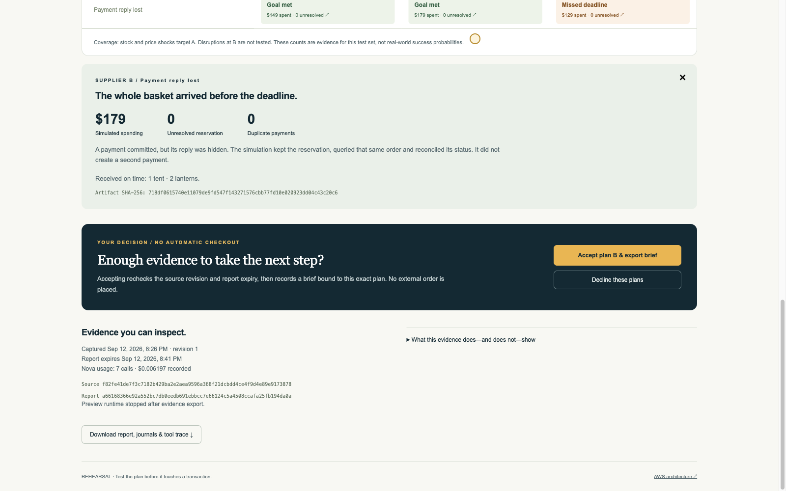
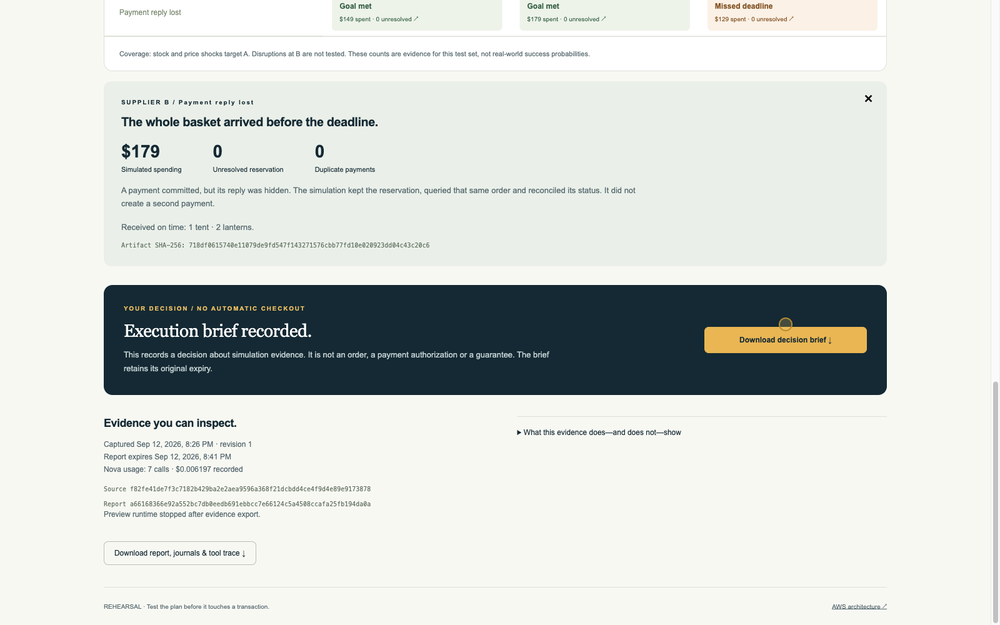

# Agents for Humans: Rehearsing an AI Agent’s Purchase Before It Spends

A serverless experiment with Amazon Nova 2 Lite: execute a proposed transaction in virtual worlds, measure the consequences, and give a person evidence for the next decision.

“We leave for our first family camping trip on Saturday. Can you get everything here by Friday evening, for under $200?”

That sounds like a straightforward shopping request. But the cheapest basket may arrive after the trip. A tent may sell out between the quote and payment. A missing payment response may leave an agent uncertain whether it should retry.

Before giving an agent permission to order, I wanted to see what its plan would actually do under those conditions.

I built **Rehearsal** for Agents for Humans to make that step visible. Amazon Nova 2 Lite proposes a plan, executable simulations measure its consequences, and a dashboard presents the results before an external transaction can happen. In the recorded demo, Nova initially selected a $149 plan. The independent report recommended a $179 alternative for review because it met all four tested conditions.

The useful output was the reason to reconsider the initial choice—and the evidence a person could inspect before deciding.



*Figure 1 — Actual AWS dashboard from the recorded Chrome walkthrough. The prices, stock and deliveries belong to a synthetic catalog.*

## Start with a decision someone understands

The demonstration fixes one request: one tent and two lanterns, delivered to the family home by Friday at 6 PM, with a $200 total budget including shipping. If a tent cannot arrive, buying the lanterns alone does not satisfy the request.

This is intentionally narrower than a general shopping assistant. The current UI selects an existing scenario; it does not parse arbitrary shopping requests or browse a live catalog. Consumer assistants such as Rufus inspired the setting, but Rehearsal has no Amazon or Rufus integration.

Three synthetic suppliers create a concrete tradeoff:

| Plan | Basket including shipping | Normal simulated arrival | Initial attraction |
|---|---:|---|---|
| A | $149 | Thursday, 6:02 PM | Early delivery at a lower price than B |
| B | $179 | Friday, 12:02 PM | Within the budget and deadline |
| C | $129 | Monday, 6:02 PM | Lowest price, but too late for the trip |

The simulator uses virtual minutes from Wednesday at 6 PM. These arrival times come from its configured schedules. They are not carrier predictions.

The shopper’s goal therefore needs more than a price comparison. The complete basket, destination, deadline, budget and handling of uncertain payments all matter.

## The workflow: freeze, propose, rehearse, inspect, decide

Rehearsal follows five stages:

1. **Freeze the input.** Capture the source revision, prices, inventory, delivery schedules and fixed shopper intent in a hashed snapshot.
2. **Propose a plan.** Nova inspects that snapshot and commits an initial supplier choice before rehearsing it.
3. **Rehearse alternatives.** Execute three supplier plans across four predefined conditions, producing twelve isolated results.
4. **Inspect the impact.** Independently verify the exported evidence and compare spending, delivery, reservations and duplicate payments.
5. **Record a decision.** Let the person decline or accept an eligible plan for execution review. Recheck the source and evidence validity before saving the brief.

The current product ends with that brief. Accepting a plan does not send an order or authorize a payment.

## What Nova does—and what the simulator measures

The planning agent uses Strands Agents SDK with Amazon Nova 2 Lite. It has three application tools:

| Tool | Responsibility |
|---|---|
| `inspect_snapshot` | Read the fixed request, source and available conditions |
| `propose_plan` | Freeze an initial complete-basket plan from A, B or C |
| `rehearse_plan` | Execute one plan under one condition and return measured results |

The model can explore alternatives and explain the tradeoffs. It cannot alter the shopper’s budget or destination, introduce arbitrary suppliers, or call an external checkout tool. The plan contract fixes the purchase and recovery sequence; the current experiment measures that sequence rather than asking a separate model agent to improvise in every cell. The implementation is in [planner.py](../src/rehearsal/preflight/planner.py) and [contracts.py](../src/rehearsal/preflight/contracts.py).

Each cell creates fresh state and a journal inside temporary runtime memory. Python code executes quote, order, authorization, reconciliation and delivery transitions. One cell cannot consume another cell’s inventory or spending allowance. The current preview does not provision twelve databases or twelve AgentCore sessions: the worlds are separate application state objects within one preview runtime session.

This distinction also limits the claim. Running a transition produces a measurable result within the implemented world. It does not establish that the world predicts a real marketplace accurately.

## Keep every planned test in the report

The four conditions are the normal quote, A losing tent stock, A increasing its tent price, and an injected loss of the payment response after a simulated commit.

After a successfully completed planning run, server code fills any cells the agent did not explore. Repeated requests for the same cell reuse its evidence. The model cannot improve the displayed result by quietly omitting an inconvenient test. If planning fails or evidence is incomplete, the workflow withholds a qualifying handoff.

A separate verifier checks the frozen inputs and replays the journals. It recomputes receipts, spending and reservations, then compares those results with the stored summaries. Missing, duplicate, unexpected or corrupted cells prevent a complete report. The aggregation logic is in [report.py](../src/rehearsal/preflight/report.py).

In the retained actual Nova run, the verified results were:

| Plan | Normal | A loses tent stock | A’s tent price increases | Payment reply lost | Conditions met |
|---|---|---|---|---|---:|
| A | Met | Blocked before payment | Blocked before payment | Met after reconciliation | 2/4 |
| B | Met | Met | Met | Met after reconciliation | 4/4 |
| C | Missed deadline | Missed deadline | Missed deadline | Missed deadline | 0/4 |

Nova’s initial A proposal stayed visible beside the independent recommendation of B. The recommendation rule selects the lowest normal-cost plan among those meeting all tested conditions with no unresolved reservations or duplicate payments, provided the full evidence set is valid.

**The stock and price shocks target A.** B’s four successful cells do not show that it survives its own stock loss or price increase. These are coverage counts for named scenarios, not probabilities of success. That limitation belongs beside the result because it changes what the shopper can reasonably conclude.

## A missing reply leaves an unresolved transaction

The payment case exposes a failure that is easy to hide behind a generic retry button.

The simulator authorizes the payment, then hides the response from the recorded buyer observation. It records the buyer’s knowledge as `UNKNOWN`, retains the reservation and queries the same order. The existing authorization is found; the simulator continues without creating a second payment.

```text
Simulated authorization commits
→ response is hidden
→ knowledge becomes UNKNOWN; reservation remains
→ query the existing payment for the same order
→ reconcile that authorization
→ observe delivery
```



*Figure 2 — Inspecting payment recovery in Chrome. The response loss is injected inside the simulator; this is not an experiment against a real payment network.*

This recovery behavior is deterministic application code. The demonstration does not establish that Nova independently discovered a safe retry strategy. It establishes that this frozen plan follows the specified recovery path and that the exported evidence contains one authorization rather than a duplicate. See [simulation.py](../src/rehearsal/preflight/simulation.py).

## Keep the preview’s AWS authority narrow


*Figure 3 — Deployed architecture using official AWS icons. The accompanying [draw.io source](architecture/rehearsal-serverless.drawio) contains two editable pages, including the separately retained legacy experiment path.*

The English React application is served from private S3 through CloudFront. API Gateway and Lambda admit a bounded preview, capture the input and start a Step Functions workflow. The preview runs Nova through Strands on a dedicated AgentCore runtime role.

That role can read its input and export raw evidence and model usage. It cannot invoke the commerce or seller Lambda functions, write the commerce table, or overwrite the frozen input and final report. A separate finalizer stops the runtime, verifies the exported journals and writes the report outside the model-writable prefixes.

DynamoDB holds the source revisions, run state, admission ledger and decisions. S3 preserves evidence after compute stops. The browser recovers a completed report from stored data; reopening it does not restart the model.

The separation matters because a planner’s answer is not the authority that declares the experiment successful. Hashes detect mismatches, while permissions protect the final report from the preview role. Neither mechanism proves that the simulator itself models reality correctly.

## Bind a decision to evidence that is still valid

A successful rehearsal can become stale while someone is reading it. Rehearsal gives the evidence a fifteen-minute validity window measured from snapshot capture, so a long-running preview consumes part of that window.

On acceptance, the API verifies the report and selected plan, checks expiry, and compares the current source with the captured source hash. It then checks the source revision and writes the decision in the same DynamoDB transaction. DynamoDB’s transaction API makes these operations succeed or fail together; it supports a `ConditionCheck` on an item separate from the decision being written. [AWS API reference](https://docs.aws.amazon.com/amazondynamodb/latest/APIReference/API_TransactWriteItems.html).

That closes the application race between reading the source and recording the decision. If the source changes during that interval, acceptance fails instead of saving a brief for stale evidence. A repeated decision returns the original brief and its original expiry.



*Figure 4 — The saved brief binds the selected plan and report. It creates no external order.*

The public demo has no login, so this click is not an authenticated financial approval. A future transaction adapter would need its own identity, current quotes and stock checks, and separately authorized execution. The source recheck here covers the operator-owned synthetic catalog.

## Serverless compute, durable evidence and visible costs

The deployed path uses no persistent application or database server. The preview executes on demand, exports its evidence and explicitly stops its AgentCore session. AWS exposes `StopRuntimeSession` for this lifecycle operation. [AgentCore session shutdown documentation](https://docs.aws.amazon.com/bedrock-agentcore/latest/devguide/runtime-stop-session.html).

This keeps the evidence available without retaining an active agent just to display it. S3 and DynamoDB storage, logs, CloudFront traffic and service requests still contribute to the AWS bill.

For the September 12 demonstration, the retained provider-usage ledger recorded:

| Measurement | Recorded value |
|---|---:|
| Actual Nova calls | 7 |
| Input tokens | 16,422 |
| Output tokens | 507 |
| Total tokens | 16,929 |
| Model-cost estimate from recorded usage | $0.006197 |
| Verified simulation cells | 12 |

The cost is one run’s model estimate using the configured rates and ledger accounting. It excludes infrastructure and narration, and has not been reconciled with the final AWS invoice. It is not a promise that another run will cost the same amount. The [retained audit](../docs/test/preflight-impact.md) links the underlying records.

Each preview reserves $0.50 from a finite shared model allowance before admission. That is an application reservation, not a fixed service price. Unknown provider usage retains its reservation rather than being counted as free, and admission limits do not guarantee a hard cap on the provider’s final bill.

There are two straightforward forms of reuse: repeated simulation-tool requests reuse a cell’s evidence within the run, and completed report reads reuse durable artifacts. Neither should be confused with a measured Bedrock prompt-cache saving.

## What the demonstration verified

The retained run used the deployed application in visible Google Chrome, with actual Nova responses. The recording covers request admission, planning, all twelve results, payment detail, decision export and reload. It is edited into a [2:53 English walkthrough](video/rehearsal-demo.mp4).

The evidence supports several distinct checks:

| Check | Observed result |
|---|---|
| Independent export audit | All twelve cells reverified locally |
| External commerce separation | Zero commerce-table rows for the preview ID |
| Workflow and cleanup | Step Functions succeeded; a separate session check returned 404 after shutdown |
| Preview IAM policy simulation | Expected commerce and protected-object permissions were denied |
| Local implementation gate | 740 Python tests, type checking, lint and web build passed |
| Separate browser gate | 28 tests passed; preview regressions use explicit HTTP fixtures |

The local fixtures and live walkthrough answer different questions. The fixtures check behaviors such as tampered evidence, omitted cells, uncertain usage, expiry, duplicate decisions and a source change during acceptance. The live run shows that the deployed Nova-to-report path worked for the recorded request. Neither establishes a financial-safety guarantee or improved user decisions.

## Where the impact needs to be tested next

For this family, the report makes a specific choice inspectable: A saves $30 compared with B but fails two named conditions; B fits the deadline across this test set; C’s lower price comes with an arrival after the trip.

To establish value beyond that demonstration, I would compare rehearsal predictions with outcomes from an independently controlled execution adapter, then test whether people make better decisions with the report. Useful measures would include constraint violations, unnecessary partial purchases, duplicate payments and the time required to understand the tradeoff.

That work needs broader disruptions, independent held-out scenarios and real participants. Live catalog access, production purchasing and those user-outcome measurements remain future work.

Rehearsal gives the person an observable step between an agent’s proposed purchase and a commitment: a fixed plan, measured consequences, explicit coverage, and evidence they can accept or reject.

The [AWS demo](https://d1u9yhii3gor6j.cloudfront.net) exposes that workflow with a finite shared run allowance. The [testing guide](../docs/submission/TESTING.md) also explains the offline checks and the distinction between the current preview and earlier Medusa experiments.
